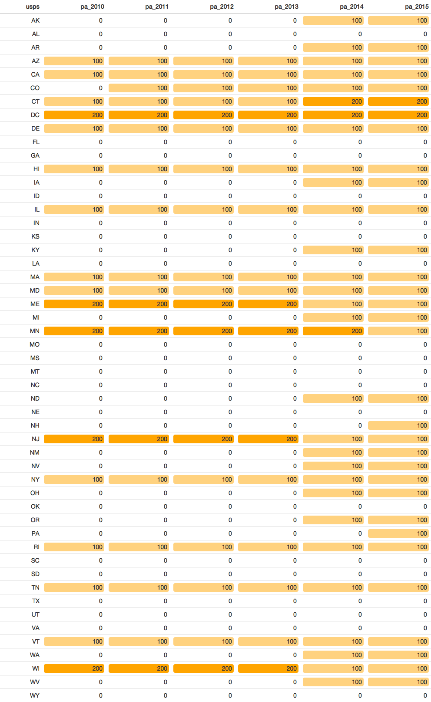

<!-- README.md is generated from README.Rmd. Please edit that file -->

[](https://travis-ci.org/jjchern/melig)

# About `melig`

The R package `melig` contains information on **M**edicaid income
**elig**ibility limits, collected by [the Kaiser Family
Foundation](http://kff.org/data-collection/trends-in-medicaid-income-eligibility-limits/).
It includes the following datasets:

  - `children.rda`:
      - [Medicaid Income Eligibility Limits for Infants Ages 0
        – 1, 2000-2018](https://www.kff.org/medicaid/state-indicator/medicaid-income-eligibility-limits-for-infants-ages-0-1/)
      - [Medicaid Income Eligibility Limits for Children Ages 1
        – 5, 2000-2018](https://www.kff.org/medicaid/state-indicator/medicaid-income-eligibility-limits-for-children-ages-1-5/)
      - [Medicaid Income Eligibility Limits for Children
        Ages 6-18, 2000-2018](https://www.kff.org/medicaid/state-indicator/medicaid-income-eligibility-limits-for-children-ages-6-18/)
      - [Separate Children’s Health Insurance Program (CHIP) Income
        Eligibility Limits for
        Children, 2000-2018](https://www.kff.org/medicaid/state-indicator/separate-childrens-health-insurance-program-chip-income-eligibility-limits-for-children/)
      - [Medicaid/CHIP Upper Income Eligibility Limits for
        Children, 2000-2018](https://www.kff.org/medicaid/state-indicator/medicaidchip-upper-income-eligibility-limits-for-children/)
  - `prenant_wom.rda`: [Medicaid and CHIP Income Eligibility Limits for
    Pregnant
    Women, 2003-2018](https://www.kff.org/medicaid/state-indicator/medicaid-and-chip-income-eligibility-limits-for-pregnant-women/)
  - `parents.rda`: [Medicaid Income Eligibility Limits for
    Parents, 2002-2018](https://www.kff.org/medicaid/state-indicator/medicaid-income-eligibility-limits-for-parents/)
  - `childless_adults.rda`: [Medicaid Income Eligibility Limits for
    Other Non-Disabled
    Adults, 2011-2018](https://www.kff.org/medicaid/state-indicator/medicaid-income-eligibility-limits-for-other-non-disabled-adults/)

The datasets are stored in tidy format (long table).

The
[`/data-raw/`](https://github.com/jjchern/melig/tree/master/data-raw)
folder contains raw data and R scripts.

# Useful Links

  - [Medicaid Income Eligibility Limits (Most Recent
    Data)](http://kff.org/state-category/medicaid-chip/medicaidchip-eligibility-limits/)
  - [Annual Updates on Eligibility Rules, Enrollment and Renewal
    Procedures, and Cost-Sharing Practices in Medicaid and
    CHIP](http://kff.org/medicaid/report/annual-updates-on-eligibility-rules-enrollment-and/)

# Installing the Package

``` r
# install.packages("remotes")
remotes::install_github("jjchern/melig")
# To uninstall the package, use:
# remove.packages("melig")
```

# Usage

## Long and Wide Formats

``` r
library(tidyverse)
library(formattable)

# the datasets have been tidied
melig::parents
#> # A tibble: 816 x 6
#>    state                fips  usps  month   year  cutoff
#>    <chr>                <chr> <chr> <chr>   <chr>  <dbl>
#>  1 Alabama              01    AL    January 2002       0
#>  2 Alaska               02    AK    January 2002       0
#>  3 Arizona              04    AZ    January 2002     100
#>  4 Arkansas             05    AR    January 2002       0
#>  5 California           06    CA    January 2002     100
#>  6 Colorado             08    CO    January 2002       0
#>  7 Connecticut          09    CT    January 2002     100
#>  8 Delaware             10    DE    January 2002     100
#>  9 District of Columbia 11    DC    January 2002     200
#> 10 Florida              12    FL    January 2002       0
#> # … with 806 more rows

# but you can covert it back to the original wide format
melig::parents %>% 
  unite_("monyear", c("month", "year"), sep = " ") %>% 
  spread(monyear, cutoff)
#> # A tibble: 51 x 19
#>    state fips  usps  `April 2003` `December 2009` `January 2002`
#>    <chr> <chr> <chr>        <dbl>           <dbl>          <dbl>
#>  1 Alab… 01    AL               0               0              0
#>  2 Alas… 02    AK               0               0              0
#>  3 Ariz… 04    AZ             200             100            100
#>  4 Arka… 05    AR               0               0              0
#>  5 Cali… 06    CA             100             100            100
#>  6 Colo… 08    CO               0               0              0
#>  7 Conn… 09    CT             100             100            100
#>  8 Dela… 10    DE             100             100            100
#>  9 Dist… 11    DC             200             200            200
#> 10 Flor… 12    FL               0               0              0
#> # … with 41 more rows, and 13 more variables: `January 2008` <dbl>,
#> #   `January 2009` <dbl>, `January 2011` <dbl>, `January 2012` <dbl>,
#> #   `January 2013` <dbl>, `January 2014` <dbl>, `January 2015` <dbl>,
#> #   `January 2016` <dbl>, `January 2017` <dbl>, `January 2018` <dbl>,
#> #   `July 2004` <dbl>, `July 2005` <dbl>, `July 2006` <dbl>
```

## States that Have Income Cutoffs Greater Than 100 Federal Poverty Guidelines in 2014

``` r
# for parents
melig::parents %>% 
  filter(year == 2014) %>% 
  filter(cutoff >= 100) %>% 
  select(state, fips, usps, pa_cutoff = cutoff) %>% 
  formattable(list(pa_cutoff = normalize_bar("lightgreen", 0.2)))
```

<table class="table table-condensed">

<thead>

<tr>

<th style="text-align:right;">

state

</th>

<th style="text-align:right;">

fips

</th>

<th style="text-align:right;">

usps

</th>

<th style="text-align:right;">

pa\_cutoff

</th>

</tr>

</thead>

<tbody>

<tr>

<td style="text-align:right;">

Alaska

</td>

<td style="text-align:right;">

02

</td>

<td style="text-align:right;">

AK

</td>

<td style="text-align:right;">

<span style="display: inline-block; direction: rtl; border-radius: 4px; padding-right: 2px; background-color: lightgreen; width: 20.00%">100</span>

</td>

</tr>

<tr>

<td style="text-align:right;">

Arizona

</td>

<td style="text-align:right;">

04

</td>

<td style="text-align:right;">

AZ

</td>

<td style="text-align:right;">

<span style="display: inline-block; direction: rtl; border-radius: 4px; padding-right: 2px; background-color: lightgreen; width: 20.00%">100</span>

</td>

</tr>

<tr>

<td style="text-align:right;">

Arkansas

</td>

<td style="text-align:right;">

05

</td>

<td style="text-align:right;">

AR

</td>

<td style="text-align:right;">

<span style="display: inline-block; direction: rtl; border-radius: 4px; padding-right: 2px; background-color: lightgreen; width: 20.00%">100</span>

</td>

</tr>

<tr>

<td style="text-align:right;">

California

</td>

<td style="text-align:right;">

06

</td>

<td style="text-align:right;">

CA

</td>

<td style="text-align:right;">

<span style="display: inline-block; direction: rtl; border-radius: 4px; padding-right: 2px; background-color: lightgreen; width: 20.00%">100</span>

</td>

</tr>

<tr>

<td style="text-align:right;">

Colorado

</td>

<td style="text-align:right;">

08

</td>

<td style="text-align:right;">

CO

</td>

<td style="text-align:right;">

<span style="display: inline-block; direction: rtl; border-radius: 4px; padding-right: 2px; background-color: lightgreen; width: 20.00%">100</span>

</td>

</tr>

<tr>

<td style="text-align:right;">

Connecticut

</td>

<td style="text-align:right;">

09

</td>

<td style="text-align:right;">

CT

</td>

<td style="text-align:right;">

<span style="display: inline-block; direction: rtl; border-radius: 4px; padding-right: 2px; background-color: lightgreen; width: 100.00%">200</span>

</td>

</tr>

<tr>

<td style="text-align:right;">

Delaware

</td>

<td style="text-align:right;">

10

</td>

<td style="text-align:right;">

DE

</td>

<td style="text-align:right;">

<span style="display: inline-block; direction: rtl; border-radius: 4px; padding-right: 2px; background-color: lightgreen; width: 20.00%">100</span>

</td>

</tr>

<tr>

<td style="text-align:right;">

District of
Columbia

</td>

<td style="text-align:right;">

11

</td>

<td style="text-align:right;">

DC

</td>

<td style="text-align:right;">

<span style="display: inline-block; direction: rtl; border-radius: 4px; padding-right: 2px; background-color: lightgreen; width: 100.00%">200</span>

</td>

</tr>

<tr>

<td style="text-align:right;">

Hawaii

</td>

<td style="text-align:right;">

15

</td>

<td style="text-align:right;">

HI

</td>

<td style="text-align:right;">

<span style="display: inline-block; direction: rtl; border-radius: 4px; padding-right: 2px; background-color: lightgreen; width: 20.00%">100</span>

</td>

</tr>

<tr>

<td style="text-align:right;">

Illinois

</td>

<td style="text-align:right;">

17

</td>

<td style="text-align:right;">

IL

</td>

<td style="text-align:right;">

<span style="display: inline-block; direction: rtl; border-radius: 4px; padding-right: 2px; background-color: lightgreen; width: 20.00%">100</span>

</td>

</tr>

<tr>

<td style="text-align:right;">

Iowa

</td>

<td style="text-align:right;">

19

</td>

<td style="text-align:right;">

IA

</td>

<td style="text-align:right;">

<span style="display: inline-block; direction: rtl; border-radius: 4px; padding-right: 2px; background-color: lightgreen; width: 20.00%">100</span>

</td>

</tr>

<tr>

<td style="text-align:right;">

Kentucky

</td>

<td style="text-align:right;">

21

</td>

<td style="text-align:right;">

KY

</td>

<td style="text-align:right;">

<span style="display: inline-block; direction: rtl; border-radius: 4px; padding-right: 2px; background-color: lightgreen; width: 20.00%">100</span>

</td>

</tr>

<tr>

<td style="text-align:right;">

Maine

</td>

<td style="text-align:right;">

23

</td>

<td style="text-align:right;">

ME

</td>

<td style="text-align:right;">

<span style="display: inline-block; direction: rtl; border-radius: 4px; padding-right: 2px; background-color: lightgreen; width: 20.00%">100</span>

</td>

</tr>

<tr>

<td style="text-align:right;">

Maryland

</td>

<td style="text-align:right;">

24

</td>

<td style="text-align:right;">

MD

</td>

<td style="text-align:right;">

<span style="display: inline-block; direction: rtl; border-radius: 4px; padding-right: 2px; background-color: lightgreen; width: 20.00%">100</span>

</td>

</tr>

<tr>

<td style="text-align:right;">

Massachusetts

</td>

<td style="text-align:right;">

25

</td>

<td style="text-align:right;">

MA

</td>

<td style="text-align:right;">

<span style="display: inline-block; direction: rtl; border-radius: 4px; padding-right: 2px; background-color: lightgreen; width: 20.00%">100</span>

</td>

</tr>

<tr>

<td style="text-align:right;">

Michigan

</td>

<td style="text-align:right;">

26

</td>

<td style="text-align:right;">

MI

</td>

<td style="text-align:right;">

<span style="display: inline-block; direction: rtl; border-radius: 4px; padding-right: 2px; background-color: lightgreen; width: 20.00%">100</span>

</td>

</tr>

<tr>

<td style="text-align:right;">

Minnesota

</td>

<td style="text-align:right;">

27

</td>

<td style="text-align:right;">

MN

</td>

<td style="text-align:right;">

<span style="display: inline-block; direction: rtl; border-radius: 4px; padding-right: 2px; background-color: lightgreen; width: 100.00%">200</span>

</td>

</tr>

<tr>

<td style="text-align:right;">

Nevada

</td>

<td style="text-align:right;">

32

</td>

<td style="text-align:right;">

NV

</td>

<td style="text-align:right;">

<span style="display: inline-block; direction: rtl; border-radius: 4px; padding-right: 2px; background-color: lightgreen; width: 20.00%">100</span>

</td>

</tr>

<tr>

<td style="text-align:right;">

New
Jersey

</td>

<td style="text-align:right;">

34

</td>

<td style="text-align:right;">

NJ

</td>

<td style="text-align:right;">

<span style="display: inline-block; direction: rtl; border-radius: 4px; padding-right: 2px; background-color: lightgreen; width: 20.00%">100</span>

</td>

</tr>

<tr>

<td style="text-align:right;">

New
Mexico

</td>

<td style="text-align:right;">

35

</td>

<td style="text-align:right;">

NM

</td>

<td style="text-align:right;">

<span style="display: inline-block; direction: rtl; border-radius: 4px; padding-right: 2px; background-color: lightgreen; width: 20.00%">100</span>

</td>

</tr>

<tr>

<td style="text-align:right;">

New
York

</td>

<td style="text-align:right;">

36

</td>

<td style="text-align:right;">

NY

</td>

<td style="text-align:right;">

<span style="display: inline-block; direction: rtl; border-radius: 4px; padding-right: 2px; background-color: lightgreen; width: 20.00%">100</span>

</td>

</tr>

<tr>

<td style="text-align:right;">

North
Dakota

</td>

<td style="text-align:right;">

38

</td>

<td style="text-align:right;">

ND

</td>

<td style="text-align:right;">

<span style="display: inline-block; direction: rtl; border-radius: 4px; padding-right: 2px; background-color: lightgreen; width: 20.00%">100</span>

</td>

</tr>

<tr>

<td style="text-align:right;">

Ohio

</td>

<td style="text-align:right;">

39

</td>

<td style="text-align:right;">

OH

</td>

<td style="text-align:right;">

<span style="display: inline-block; direction: rtl; border-radius: 4px; padding-right: 2px; background-color: lightgreen; width: 20.00%">100</span>

</td>

</tr>

<tr>

<td style="text-align:right;">

Oregon

</td>

<td style="text-align:right;">

41

</td>

<td style="text-align:right;">

OR

</td>

<td style="text-align:right;">

<span style="display: inline-block; direction: rtl; border-radius: 4px; padding-right: 2px; background-color: lightgreen; width: 20.00%">100</span>

</td>

</tr>

<tr>

<td style="text-align:right;">

Rhode
Island

</td>

<td style="text-align:right;">

44

</td>

<td style="text-align:right;">

RI

</td>

<td style="text-align:right;">

<span style="display: inline-block; direction: rtl; border-radius: 4px; padding-right: 2px; background-color: lightgreen; width: 20.00%">100</span>

</td>

</tr>

<tr>

<td style="text-align:right;">

Tennessee

</td>

<td style="text-align:right;">

47

</td>

<td style="text-align:right;">

TN

</td>

<td style="text-align:right;">

<span style="display: inline-block; direction: rtl; border-radius: 4px; padding-right: 2px; background-color: lightgreen; width: 20.00%">100</span>

</td>

</tr>

<tr>

<td style="text-align:right;">

Vermont

</td>

<td style="text-align:right;">

50

</td>

<td style="text-align:right;">

VT

</td>

<td style="text-align:right;">

<span style="display: inline-block; direction: rtl; border-radius: 4px; padding-right: 2px; background-color: lightgreen; width: 20.00%">100</span>

</td>

</tr>

<tr>

<td style="text-align:right;">

Washington

</td>

<td style="text-align:right;">

53

</td>

<td style="text-align:right;">

WA

</td>

<td style="text-align:right;">

<span style="display: inline-block; direction: rtl; border-radius: 4px; padding-right: 2px; background-color: lightgreen; width: 20.00%">100</span>

</td>

</tr>

<tr>

<td style="text-align:right;">

West
Virginia

</td>

<td style="text-align:right;">

54

</td>

<td style="text-align:right;">

WV

</td>

<td style="text-align:right;">

<span style="display: inline-block; direction: rtl; border-radius: 4px; padding-right: 2px; background-color: lightgreen; width: 20.00%">100</span>

</td>

</tr>

<tr>

<td style="text-align:right;">

Wisconsin

</td>

<td style="text-align:right;">

55

</td>

<td style="text-align:right;">

WI

</td>

<td style="text-align:right;">

<span style="display: inline-block; direction: rtl; border-radius: 4px; padding-right: 2px; background-color: lightgreen; width: 20.00%">100</span>

</td>

</tr>

</tbody>

</table>

``` r

# for childless adults
melig::childless_adults %>% 
  filter(year == 2014) %>% 
  filter(cutoff >= 100) %>% 
  select(state, fips, usps, ca_cutoff = cutoff) %>% 
  formattable(list(ca_cutoff = normalize_bar("lightgreen", 0.2))) 
```

<table class="table table-condensed">

<thead>

<tr>

<th style="text-align:right;">

state

</th>

<th style="text-align:right;">

fips

</th>

<th style="text-align:right;">

usps

</th>

<th style="text-align:right;">

ca\_cutoff

</th>

</tr>

</thead>

<tbody>

<tr>

<td style="text-align:right;">

Arizona

</td>

<td style="text-align:right;">

04

</td>

<td style="text-align:right;">

AZ

</td>

<td style="text-align:right;">

<span style="display: inline-block; direction: rtl; border-radius: 4px; padding-right: 2px; background-color: lightgreen; width: 46.43%">138</span>

</td>

</tr>

<tr>

<td style="text-align:right;">

Arkansas

</td>

<td style="text-align:right;">

05

</td>

<td style="text-align:right;">

AR

</td>

<td style="text-align:right;">

<span style="display: inline-block; direction: rtl; border-radius: 4px; padding-right: 2px; background-color: lightgreen; width: 46.43%">138</span>

</td>

</tr>

<tr>

<td style="text-align:right;">

California

</td>

<td style="text-align:right;">

06

</td>

<td style="text-align:right;">

CA

</td>

<td style="text-align:right;">

<span style="display: inline-block; direction: rtl; border-radius: 4px; padding-right: 2px; background-color: lightgreen; width: 46.43%">138</span>

</td>

</tr>

<tr>

<td style="text-align:right;">

Colorado

</td>

<td style="text-align:right;">

08

</td>

<td style="text-align:right;">

CO

</td>

<td style="text-align:right;">

<span style="display: inline-block; direction: rtl; border-radius: 4px; padding-right: 2px; background-color: lightgreen; width: 46.43%">138</span>

</td>

</tr>

<tr>

<td style="text-align:right;">

Connecticut

</td>

<td style="text-align:right;">

09

</td>

<td style="text-align:right;">

CT

</td>

<td style="text-align:right;">

<span style="display: inline-block; direction: rtl; border-radius: 4px; padding-right: 2px; background-color: lightgreen; width: 46.43%">138</span>

</td>

</tr>

<tr>

<td style="text-align:right;">

Delaware

</td>

<td style="text-align:right;">

10

</td>

<td style="text-align:right;">

DE

</td>

<td style="text-align:right;">

<span style="display: inline-block; direction: rtl; border-radius: 4px; padding-right: 2px; background-color: lightgreen; width: 46.43%">138</span>

</td>

</tr>

<tr>

<td style="text-align:right;">

District of
Columbia

</td>

<td style="text-align:right;">

11

</td>

<td style="text-align:right;">

DC

</td>

<td style="text-align:right;">

<span style="display: inline-block; direction: rtl; border-radius: 4px; padding-right: 2px; background-color: lightgreen; width: 100.00%">215</span>

</td>

</tr>

<tr>

<td style="text-align:right;">

Hawaii

</td>

<td style="text-align:right;">

15

</td>

<td style="text-align:right;">

HI

</td>

<td style="text-align:right;">

<span style="display: inline-block; direction: rtl; border-radius: 4px; padding-right: 2px; background-color: lightgreen; width: 46.43%">138</span>

</td>

</tr>

<tr>

<td style="text-align:right;">

Illinois

</td>

<td style="text-align:right;">

17

</td>

<td style="text-align:right;">

IL

</td>

<td style="text-align:right;">

<span style="display: inline-block; direction: rtl; border-radius: 4px; padding-right: 2px; background-color: lightgreen; width: 46.43%">138</span>

</td>

</tr>

<tr>

<td style="text-align:right;">

Iowa

</td>

<td style="text-align:right;">

19

</td>

<td style="text-align:right;">

IA

</td>

<td style="text-align:right;">

<span style="display: inline-block; direction: rtl; border-radius: 4px; padding-right: 2px; background-color: lightgreen; width: 46.43%">138</span>

</td>

</tr>

<tr>

<td style="text-align:right;">

Kentucky

</td>

<td style="text-align:right;">

21

</td>

<td style="text-align:right;">

KY

</td>

<td style="text-align:right;">

<span style="display: inline-block; direction: rtl; border-radius: 4px; padding-right: 2px; background-color: lightgreen; width: 46.43%">138</span>

</td>

</tr>

<tr>

<td style="text-align:right;">

Maryland

</td>

<td style="text-align:right;">

24

</td>

<td style="text-align:right;">

MD

</td>

<td style="text-align:right;">

<span style="display: inline-block; direction: rtl; border-radius: 4px; padding-right: 2px; background-color: lightgreen; width: 46.43%">138</span>

</td>

</tr>

<tr>

<td style="text-align:right;">

Massachusetts

</td>

<td style="text-align:right;">

25

</td>

<td style="text-align:right;">

MA

</td>

<td style="text-align:right;">

<span style="display: inline-block; direction: rtl; border-radius: 4px; padding-right: 2px; background-color: lightgreen; width: 46.43%">138</span>

</td>

</tr>

<tr>

<td style="text-align:right;">

Michigan

</td>

<td style="text-align:right;">

26

</td>

<td style="text-align:right;">

MI

</td>

<td style="text-align:right;">

<span style="display: inline-block; direction: rtl; border-radius: 4px; padding-right: 2px; background-color: lightgreen; width: 46.43%">138</span>

</td>

</tr>

<tr>

<td style="text-align:right;">

Minnesota

</td>

<td style="text-align:right;">

27

</td>

<td style="text-align:right;">

MN

</td>

<td style="text-align:right;">

<span style="display: inline-block; direction: rtl; border-radius: 4px; padding-right: 2px; background-color: lightgreen; width: 89.57%">200</span>

</td>

</tr>

<tr>

<td style="text-align:right;">

Nevada

</td>

<td style="text-align:right;">

32

</td>

<td style="text-align:right;">

NV

</td>

<td style="text-align:right;">

<span style="display: inline-block; direction: rtl; border-radius: 4px; padding-right: 2px; background-color: lightgreen; width: 46.43%">138</span>

</td>

</tr>

<tr>

<td style="text-align:right;">

New
Jersey

</td>

<td style="text-align:right;">

34

</td>

<td style="text-align:right;">

NJ

</td>

<td style="text-align:right;">

<span style="display: inline-block; direction: rtl; border-radius: 4px; padding-right: 2px; background-color: lightgreen; width: 46.43%">138</span>

</td>

</tr>

<tr>

<td style="text-align:right;">

New
Mexico

</td>

<td style="text-align:right;">

35

</td>

<td style="text-align:right;">

NM

</td>

<td style="text-align:right;">

<span style="display: inline-block; direction: rtl; border-radius: 4px; padding-right: 2px; background-color: lightgreen; width: 46.43%">138</span>

</td>

</tr>

<tr>

<td style="text-align:right;">

New
York

</td>

<td style="text-align:right;">

36

</td>

<td style="text-align:right;">

NY

</td>

<td style="text-align:right;">

<span style="display: inline-block; direction: rtl; border-radius: 4px; padding-right: 2px; background-color: lightgreen; width: 46.43%">138</span>

</td>

</tr>

<tr>

<td style="text-align:right;">

North
Dakota

</td>

<td style="text-align:right;">

38

</td>

<td style="text-align:right;">

ND

</td>

<td style="text-align:right;">

<span style="display: inline-block; direction: rtl; border-radius: 4px; padding-right: 2px; background-color: lightgreen; width: 46.43%">138</span>

</td>

</tr>

<tr>

<td style="text-align:right;">

Ohio

</td>

<td style="text-align:right;">

39

</td>

<td style="text-align:right;">

OH

</td>

<td style="text-align:right;">

<span style="display: inline-block; direction: rtl; border-radius: 4px; padding-right: 2px; background-color: lightgreen; width: 46.43%">138</span>

</td>

</tr>

<tr>

<td style="text-align:right;">

Oregon

</td>

<td style="text-align:right;">

41

</td>

<td style="text-align:right;">

OR

</td>

<td style="text-align:right;">

<span style="display: inline-block; direction: rtl; border-radius: 4px; padding-right: 2px; background-color: lightgreen; width: 46.43%">138</span>

</td>

</tr>

<tr>

<td style="text-align:right;">

Rhode
Island

</td>

<td style="text-align:right;">

44

</td>

<td style="text-align:right;">

RI

</td>

<td style="text-align:right;">

<span style="display: inline-block; direction: rtl; border-radius: 4px; padding-right: 2px; background-color: lightgreen; width: 46.43%">138</span>

</td>

</tr>

<tr>

<td style="text-align:right;">

Vermont

</td>

<td style="text-align:right;">

50

</td>

<td style="text-align:right;">

VT

</td>

<td style="text-align:right;">

<span style="display: inline-block; direction: rtl; border-radius: 4px; padding-right: 2px; background-color: lightgreen; width: 46.43%">138</span>

</td>

</tr>

<tr>

<td style="text-align:right;">

Washington

</td>

<td style="text-align:right;">

53

</td>

<td style="text-align:right;">

WA

</td>

<td style="text-align:right;">

<span style="display: inline-block; direction: rtl; border-radius: 4px; padding-right: 2px; background-color: lightgreen; width: 46.43%">138</span>

</td>

</tr>

<tr>

<td style="text-align:right;">

West
Virginia

</td>

<td style="text-align:right;">

54

</td>

<td style="text-align:right;">

WV

</td>

<td style="text-align:right;">

<span style="display: inline-block; direction: rtl; border-radius: 4px; padding-right: 2px; background-color: lightgreen; width: 46.43%">138</span>

</td>

</tr>

<tr>

<td style="text-align:right;">

Wisconsin

</td>

<td style="text-align:right;">

55

</td>

<td style="text-align:right;">

WI

</td>

<td style="text-align:right;">

<span style="display: inline-block; direction: rtl; border-radius: 4px; padding-right: 2px; background-color: lightgreen; width: 20.00%">100</span>

</td>

</tr>

</tbody>

</table>

## Income Cutoffs for Parents in 2010–2015

``` r
melig::parents %>% 
  mutate(
    year = if_else(year == "2009" & month == "December", "2010", year),
    year = year %>% as.integer()
  ) %>% 
  filter(year %in% 2010:2015) %>% 
  select(-month, -state, -fips) %>% 
  tidyr::spread(year, cutoff) %>% 
  rename(
    pa_2010 = `2010`,
    pa_2011 = `2011`,
    pa_2012 = `2012`,
    pa_2013 = `2013`,
    pa_2014 = `2014`,
    pa_2015 = `2015`
  ) %>% 
  formattable(
    list(
     pa_2010 = color_tile("white", "orange"),
     pa_2011 = color_tile("white", "orange"),
     pa_2012 = color_tile("white", "orange"),
     pa_2013 = color_tile("white", "orange"),
     pa_2014 = color_tile("white", "orange"),
     pa_2015 = color_tile("white", "orange")
    )
  ) %>% 
  export_formattable("pa_cutoffs.png")
```



## Income Cutoffs for Childless Adults in 2011–2015

``` r
melig::childless_adults %>% 
  mutate(year = as.integer(year)) %>% 
  filter(year %in% 2011:2015) %>% 
  select(-month, -state, -fips) %>% 
  tidyr::spread(year, cutoff) %>% 
  rename(
    ca_2011 = `2011`,
    ca_2012 = `2012`,
    ca_2013 = `2013`,
    ca_2014 = `2014`,
    ca_2015 = `2015`
  ) %>% 
  formattable(
    list(
      ca_2011 = color_tile("white", "orange"),
      ca_2012 = color_tile("white", "orange"),
      ca_2013 = color_tile("white", "orange"),
      ca_2014 = color_tile("white", "orange"),
      ca_2015 = color_tile("white", "orange")
    )
  ) %>% 
  export_formattable("ca_cutoffs.png") 
```


## Income Cutoffs for Children

*Note*: The children dataset, `melig::children`, has

  - a `type` variable that separates Medicaid and CHIP programs, and
  - an `agegrp` variable that indicates specific age groups.

Because the age information for the CHIP programs (`type == CHIP`) is
not available from the source data, I assign a value of “0-18” to the
corresponding `age` variable, though some states’ CHIP programs don’t
cover all children under age 19 in some years.

``` r
# the data
melig::children
#> # A tibble: 3,060 x 8
#>    state    fips usps  type     agegrp month   year  cutoff
#>    <chr>   <int> <chr> <chr>    <chr>  <chr>   <chr>  <int>
#>  1 Alabama     1 AL    Medicaid 0-1    October 2000     133
#>  2 Alabama     1 AL    Medicaid 1-5    October 2000     133
#>  3 Alabama     1 AL    Medicaid 6-18   October 2000     100
#>  4 Alabama     1 AL    CHIP     0-18   October 2000     200
#>  5 Alabama     1 AL    Medicaid 0-1    January 2002     133
#>  6 Alabama     1 AL    Medicaid 1-5    January 2002     133
#>  7 Alabama     1 AL    Medicaid 6-18   January 2002     100
#>  8 Alabama     1 AL    CHIP     0-18   January 2002     200
#>  9 Alabama     1 AL    Medicaid 0-1    April   2003     133
#> 10 Alabama     1 AL    Medicaid 1-5    April   2003     133
#> # … with 3,050 more rows

# IL
melig::children %>% 
  filter(usps == "IL") 
#> # A tibble: 60 x 8
#>    state     fips usps  type     agegrp month   year  cutoff
#>    <chr>    <int> <chr> <chr>    <chr>  <chr>   <chr>  <int>
#>  1 Illinois    17 IL    Medicaid 0-1    October 2000     200
#>  2 Illinois    17 IL    Medicaid 1-5    October 2000     133
#>  3 Illinois    17 IL    Medicaid 6-18   October 2000     133
#>  4 Illinois    17 IL    CHIP     0-18   October 2000     185
#>  5 Illinois    17 IL    Medicaid 0-1    January 2002     200
#>  6 Illinois    17 IL    Medicaid 1-5    January 2002     133
#>  7 Illinois    17 IL    Medicaid 6-18   January 2002     133
#>  8 Illinois    17 IL    CHIP     0-18   January 2002     185
#>  9 Illinois    17 IL    Medicaid 0-1    April   2003     200
#> 10 Illinois    17 IL    Medicaid 1-5    April   2003     133
#> # … with 50 more rows
```

## Save as Other Data Formats

``` r
# save as Stata format
haven::write_dta(melig::parents, "pa0218.dta")

# or
rio::export(melig::parents, "pa0218.dta")
```

Or download the `*.rda` file and try the
[rioweb](https://lbraglia.shinyapps.io/rioweb) made by
@[lbraglia](https://github.com/lbraglia).
